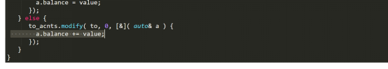
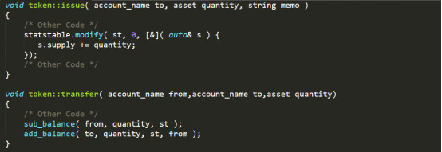
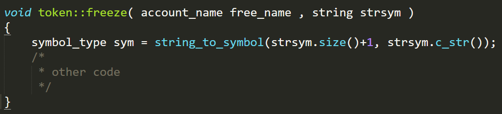
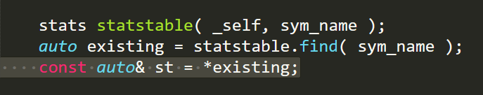
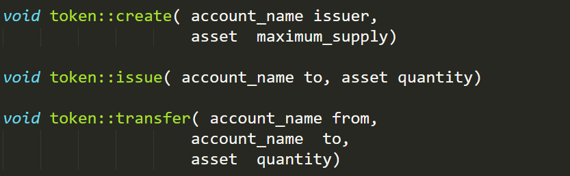
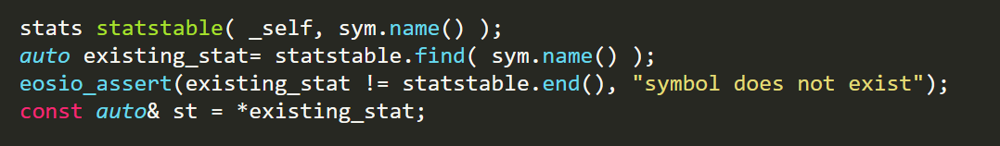
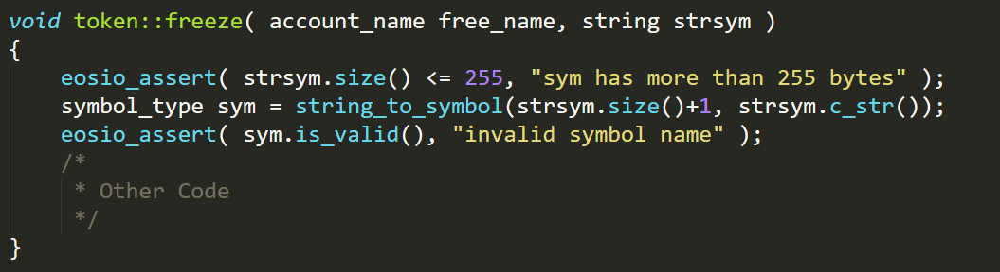

近期，链安科技利用VaaS-EOS自动化合约审计工具对多个EOS合约进行了安全审计，发现存在整型溢出等问题，部分合约实现不够严谨。为了便于大家在EOS平台写出更加安全的智能合约，我们将发现的一系列问题进行了分析和总结，并给出了建议。

主要存在的问题包括：

一、存在整型溢出错误；

二、权限检查不严谨；

三、API函数的不规范使用；

四、常规代码错误。

**EOS合约存在不严谨之处**

我们通过对已审核的EOS合约分析，发现存在如下主要问题：  

1、存在整型溢出错误

使用自己的数据结构描述代币，对代币数值进行算数运算时未进行安全检查。在误操作时容易产生整型溢出错误，可能导致代币量归零甚至变成负数的严重结果！

2、权限检查不严谨

权限检查不严谨，造成逻辑漏洞。部分代币合约设置了冻结账户和代币的功能，然而用户将检查 “冻结” 的代码仅仅放在transfer（转账）函数中，从而导致执行issue（发行代币）的时候不受“冻结”状态影响，可以任意增发代币。

3、API函数的不规范使用

注意EOS API函数的参数类型。如 string_to_symbol(uint8_t , const char *)，第一个参数传入的整型变量需要小于256，若使用该API前未对输入进行检查，则可能导致整型溢出，从而导致操作了错误类型的代币，带来严重后果。

4、常规代码错误

数据库API使用不严谨，如multi_index中提供的get和find。其中get会检查数据是否查询成功，数据未找到则断言退出，而find不会检查数据查询情况，需要用户自行判断，如果缺少判断直接使用将会导致指针使用问题。

**如何避免将会导致的风险**

既然EOS代币合约存在不严谨之处，那么作为项目方应该如何去防范后期可能造成的风险呢？我们给出下面三种建议方法：

 

1.合约中使用官方提供的 asset 数据结构描述代币，对代币的算数运算同样利用asset完成。

2.在使用multi_index的find函数时，一定要进行返回值的检查。

3.对所有输入都通过断言检查有效性，调用API函数前，检查参数类型和大小。

最后，建议代币合约参照EOS官方给出的eosio.token示例进行实现，避免疏忽从而导致安全检查不完备。

**项目方应该引起足够的重视**

EOS代币合约虽然目前还没有上线，但是项目方一定不能掉以轻心，避免再次重蹈整型溢出等问题引发的代币被盗事件。

总体而言，我们认为从目前审计EOS代币合约所遇到的问题来看，开发者在合约敏感代码（如操作代币数额）前后，一定要做好参数限制和权限检查，使用EOS API时一定要搞清楚该函数的输入限制和返回值形式，同时多多参考官方的示例实现。

另一方面，智能合约安全作为一个关键的链上交易程序，一旦部署将无法撤销。因此，项目方合约开发完成后除了自己做好测试外，选择专业的第三方单位进行安全审计也是很有必要的，因为安全审计公司能多角度分析合约代码，找出开发者容易忽略的问题，做到事先预防安全事件的发生。