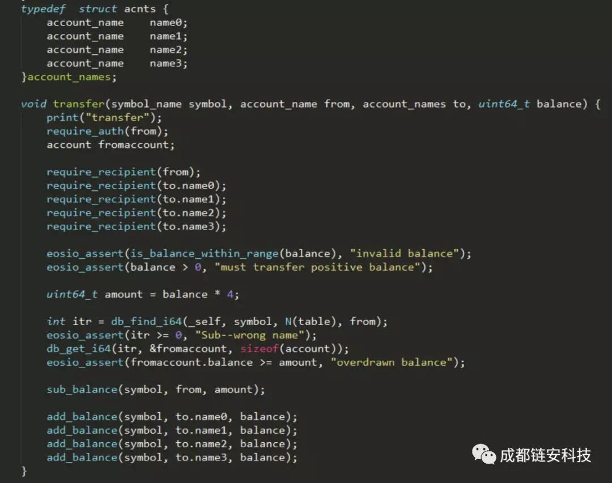
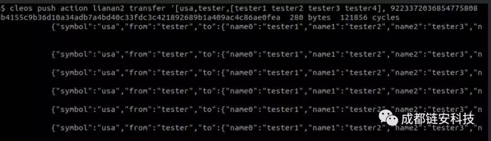
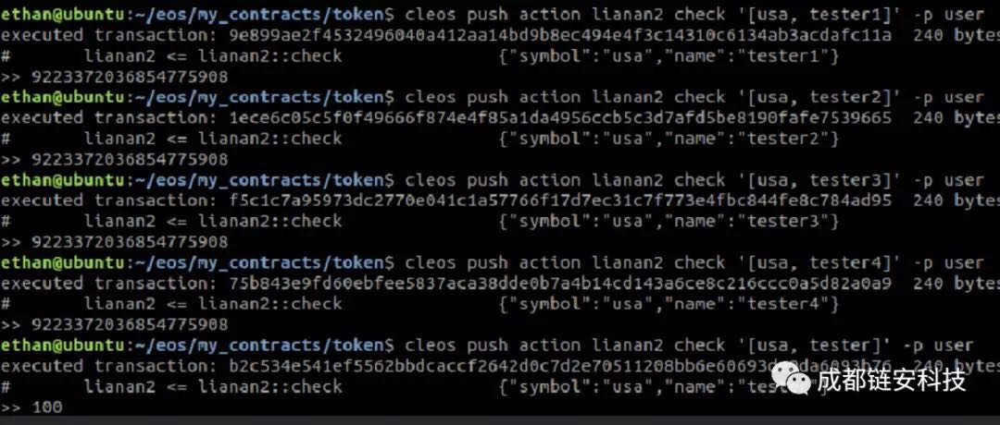

免责声明：

这次测试并没有使用EOS原生令牌合约。

这块的最佳实践是让开发者尽量使用原生令牌合约测试而不是自己创建。创建智能合约的开发者需要负责编写和测试代码，以防止各种溢出错误。

据成都链安科技消息，其研发的面向区块链形式化验证平台VaaS发现，如果合约开发者不够仔细，则基于EOS区块链的代币合约也同样可能存在BEC代币合约类似的整数溢出漏洞。

眼下Beauty Chain 美链/BEC代币被盗事件，由于一行代码的安全漏洞引发其市值一夜归零。该漏洞，由于合约开发者经验不足导致合约代码中的bathTransfer函数出现了整型溢出的漏洞，使黑客利用该漏洞盗走

57,896,044,618,658,100,000,000,000,000,000,000,000,000,000,000,000,000,000,000.792003956564819968 个BEC代币。

针对此漏洞，成都链安科技通过其研发的VaaS形式化验证平台对EOS区块链平台的智能合约进行了整型溢出漏洞检查和安全验证，发现基于EOS平台开发类似智能合约同样可能出现整型溢出漏洞。下面以EOS代币合约为例对该类型漏洞进行描述，该实例中设计并实现了一个向多人转账的智能合约核心函数transfer，其源代码如图1所示：

图1 transfer函数源码，同时向4个人转账

假设攻击者调用该合约的transfer函数同时向4个人进行转账操作，并将balance参数的值设为2的63次方，函数调用过程如图2所示：

图2  黑客调用transfer函数同时向4人转账

接着，查询以上地址余额可发现，被转账人（tester）的余额（100）没有减少，而接收者（tester1、tester2、tester3、tester4）的账户余额由于amount变量的溢出产生了非常大的数目（2的63次方），如图3所示：

漏洞分析：balance是uint64数据类型，当取值为2的63次方时，由于小于uint64可取值的最大值，于是绕过了对balance的溢出边界检查；但是，当amount=balance*4计算时，amount便发生了溢出，使其值等于0，由于amount此时绕过了被减数大于减数的检查，从而实现不消耗被转账人的balance的情况下，让转账人的balance获取非常大的值（2的63此方）。

为此，成都链安科技提示基于EOS的智能合约开发者，在开发智能合约的时候，应警觉整数溢出漏洞可能带来的严重后果，对于每一步运算操作均进行边界检查。

针对此类问题，我们提出如下四种解决方案：

1、在智能合约部署前，通过VaaS平台进行安全性和功能正确性的形式化验证，事先预防这类问题的发生；目前VaaS平台已经支持以太坊，EOS，Fabric等主流区块链平台智能合约的形式化验证，提供了高度自动化的智能合约漏洞检查，安全性、功能正确性的形式化验证。

2、我们正在针对EOS，以太坊等平台开发安全的智能合约开发模板，规范智能合约的开发，提高合约安全性，同时降低合约开发门槛和难度；

3、向社区提供经过VaaS平台验证的合约核心模块，用户通过调用这些模块开发自己的智能合约，以减少合约安全漏洞和逻辑漏洞的发生。

如，我们正在基于EOS开发经过VaaS平台形式化验证的安全运算模块（如类似太坊SafeMath模块），以防止运算中导致的溢出和零除等漏洞。

后续，我们将继续为EOS、以太坊等多个社区开发更多的合约功能模块，供合约开发者使用。

4、建议合约开发者使用EOS区块链平台提供的智能合约编程Math API接口则可防止该类型溢出漏洞。

如：合约开发者可将uint类型的数据，先转换成doule类型的数据，然后再使用EOS区块链平台提供的Math API中的double_add、double_mult等函数进行运算，最后将计算结果再转换成uint类型数据输出。

通过我们的实验和测试，发现该函数在进行大数相乘出现溢出的时候，会返回较大的值，无溢出出现，于是可以有效避免上述整型溢出的漏洞。但是VaaS同时也检测出，Math API接口没有对负数情况进行检查，如果double运算的结果为负数，在将其强制转换成uint类型时，将同时返回一个错误的较大的数值，针对此问题开发者需谨慎使用。