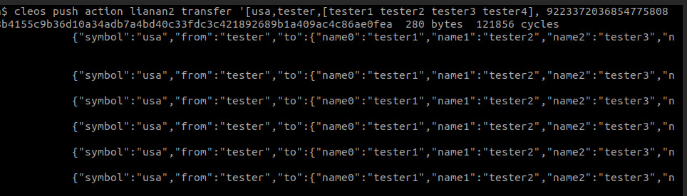

4月28日，**成都链安科技**向巴比特透露，其研发的面向区块链形式化验证平台**VaaS**（Verification as a Service）检测发现，基于EOS区块链的代币合约同样可能存在BEC代币合约类似的整数溢出漏洞。

 

最近BEC代币被盗事件，由于一行代码的安全漏洞引发其市值几乎归零。该漏洞是由于合约开发者在一段代码中未使用safeMath保证计算的安全性，从而导致黑客利用batchTransfer函数出现了整型溢出的漏洞，黑客利用该漏洞盗走

57,896,044,618,658,100,000,000,000,000,000,000,000,000,000,000,000,000,000,000.792003956564819968 个BEC代币。

 

针对此漏洞，VaaS形式化验证平台对EOS区块链平台的智能合约进行了**整型溢出漏洞检查和安全验证**，发现基于EOS平台开发类似智能合约同样可能出现整型溢出漏洞。

 

以下为链安科技向巴比特提供的其设计的一个通过向多人转账的智能合约核心函数transfer实例，演示EOS智能合约漏洞：

 

源代码如图1所示：

图1：transfer函数源码，同时向4个人转账

 

假设攻击者调用该合约的transfer函数同时向4个人进行转账操作，并将balance参数的值设为263，函数调用过程如图2所示：

 

图2：黑客调用transfer函数同时向4人转账

 

接着，查询以上地址余额可发现，被转账人（tester）的余额（100）没有减少，而接收者（tester1、tester2、tester3、tester4）的账户余额由于amount变量的溢出产生了非常大的数目（263），如图3所示:

 

图3：接收者的账户余额产生了非常大的数目

 

漏洞分析：balance是uint64数据类型，当取值为263时，由于小于uint64可取值的最大值，于是绕过了对balance的溢出边界检查；但是，当amount=balance*4计算时，amount便发生了溢出，使其值等于0，由于amount此时绕过了被减数大于减数的检查，从而实现不消耗被转账人的balance的情况下，让转账人的balance获取非常大的值（263）。

 

针对此类问题，链安科技也提出解决方案：**在智能合约部署前进行安全性和功能正确性的形式化验证，事先预防这类问题的发生**；针对EOS、以太坊等平台开发安全的智能合约开发模板，规范智能合约的开发，提高合约安全性，同时降低合约开发门槛和难度；合约开发者使用EOS区块链平台提供的智能合约编程Math API接口可防止该类型溢出漏洞。如合约开发者可将uint类型的数据，先转换成doule类型的数据，然后再使用EOS区块链平台提供的Math API中的double_add、double_mult等函数进行运算，最后将计算结果再转换成uint类型数据输出。但Math API接口没有对负数情况进行检查，如果double运算的结果为负数，再将其强制转换成uint类型时，将同时返回一个错误的较大的数值，针对此问题开发者需谨慎使用。

 

EOS官方做出了如下回复：

 

Thomas在回复中对形式化验证用于智能合约安全检测表示称赞，认为这一问题的出现主要表明智能合约开发者不够仔细。同时还指出，核心的EOS原生令牌合约不会受到这种形式的攻击。

 